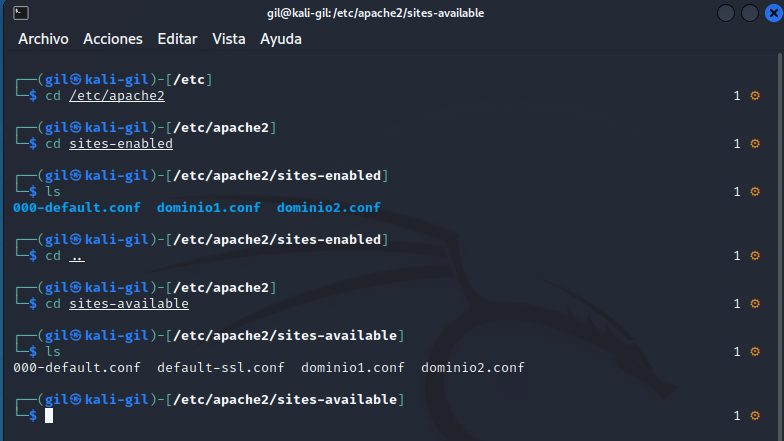
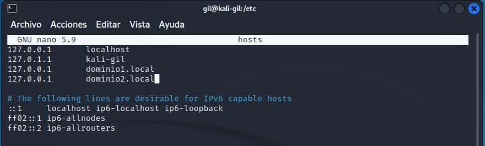
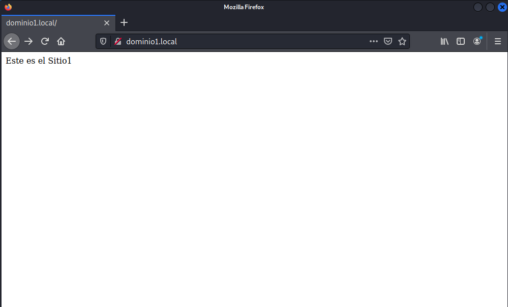
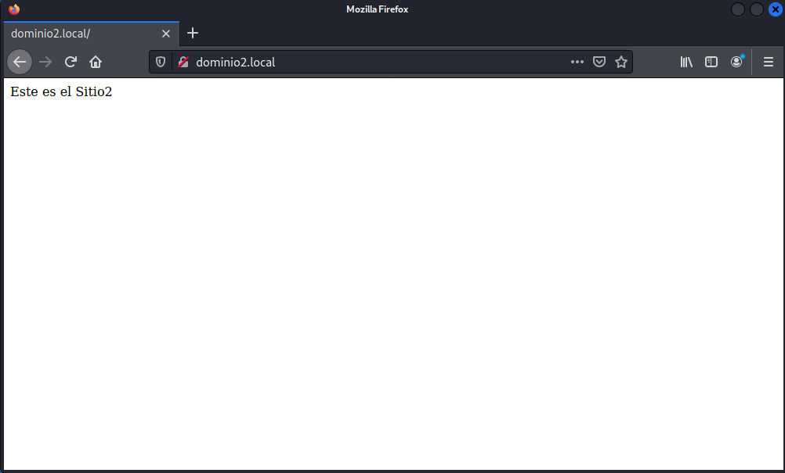
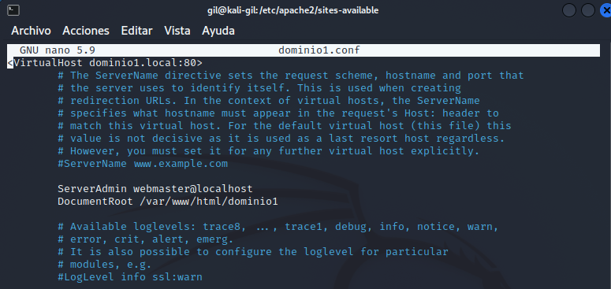
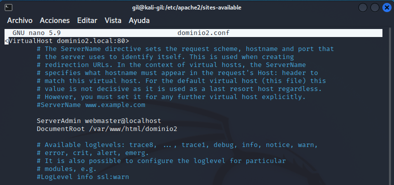
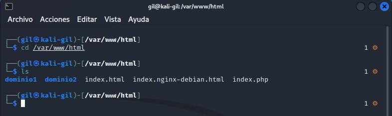

Configuración básica de Apache

### Tarea 1

- En la siguiente captura se puede ver el contenido de los directorios sites-available` y `sites-enabled:

  

  

- En la siguiente captura se puede ver el contenido del archivo hosts:

  

  

- En la siguiente captura se puede ver las dos pantallas del navegador pidiendo los dos sitios:

  

  

- A continuación se puede ver el contenido de los directorios creados dentro del DocumentRoot definido en cada sitio:

  

  

- Al final se puede ver a continuación, el contenido del directorio var/www/html:

  

