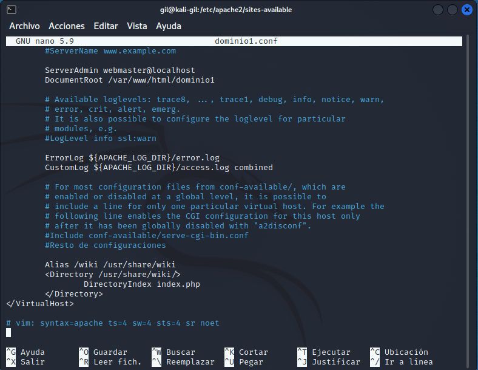
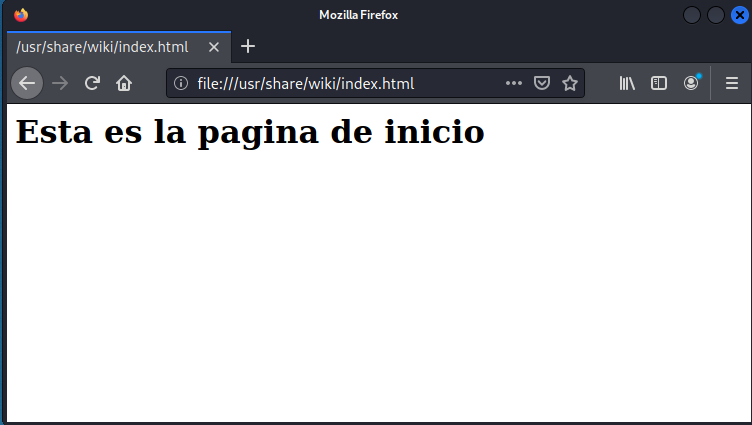

typora-copy-images-to: ../imagenes
typora-root-url: ../

Configuración básica de Apache

### Tarea 2

- En la siguiente captura se puede ver las modificaciones del contenido del archivo de configuración del dominio1.conf en el directorio sites-available:

* En la siguiente captura se puede ver el contenido del navegador cuando se accede a la pagina index:

  

