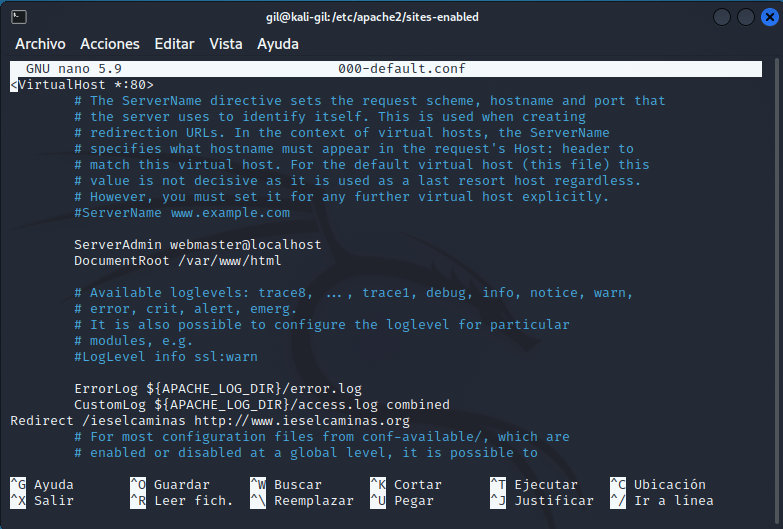
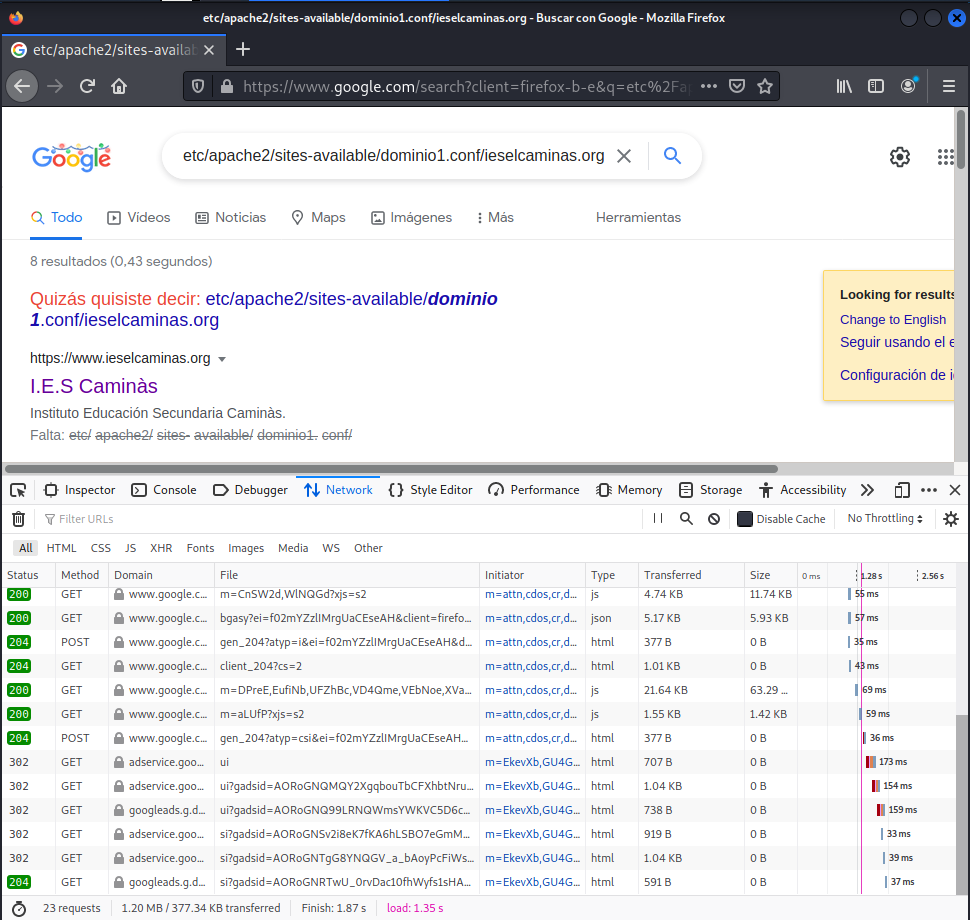

typora-copy-images-to: ../imagenes
typora-root-url: ../

Configuración básica de Apache

### Tarea 3

- En la siguiente captura se puede ver las modificaciones del contenido del archivo de configuración del archivo de configuración 000-default.conf en el directorio sites-enabled:

  

* En la siguiente captura se puede ver el Firebug donde se vea el status code 302:

---

