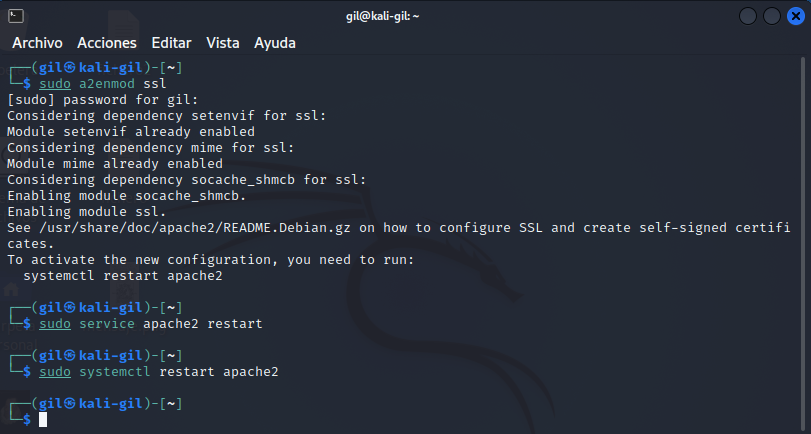
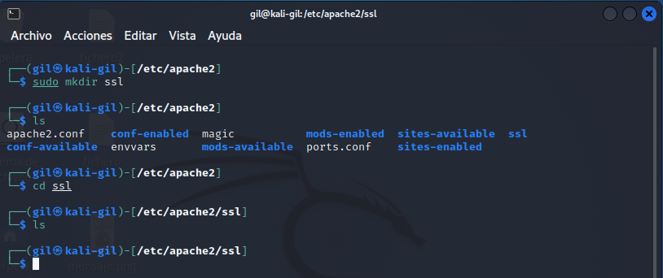
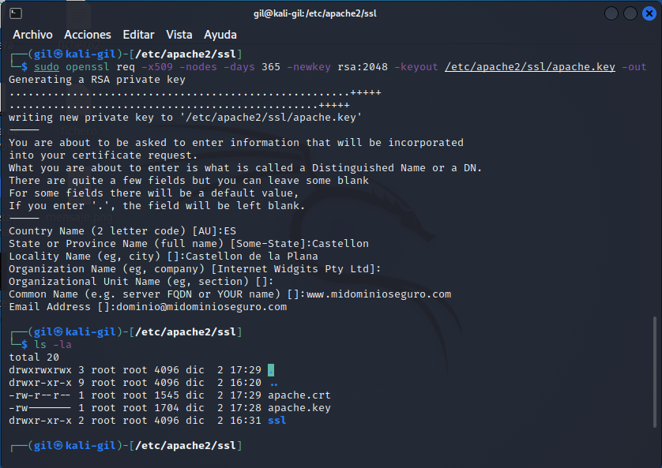
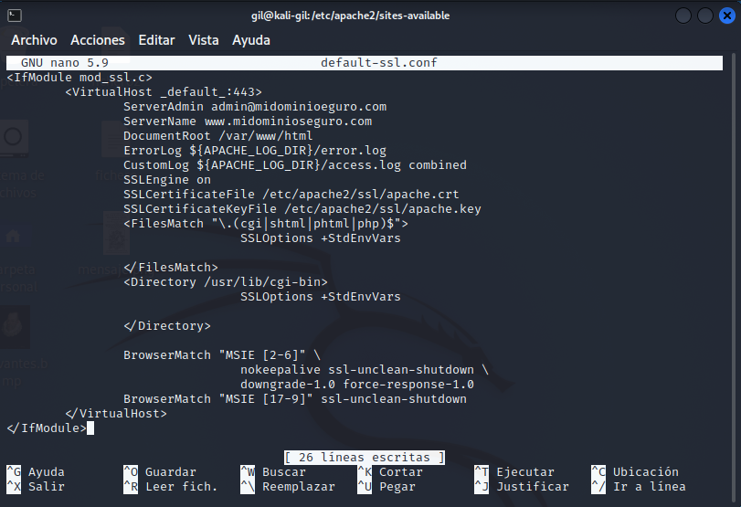
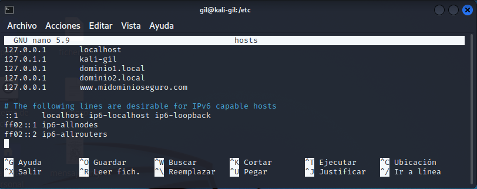
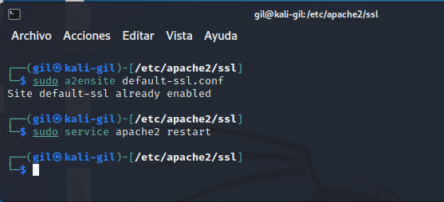
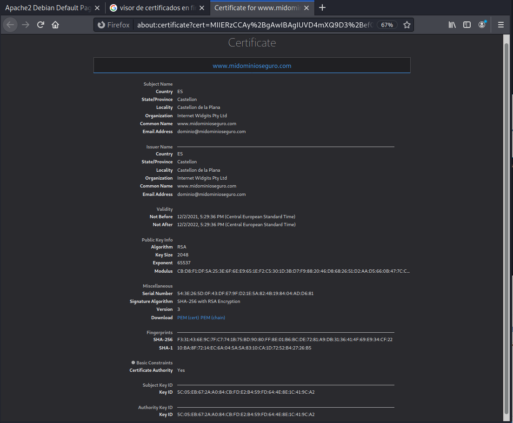

typora-copy-images-to: ../imagenes
typora-root-url: ../

# Certificado digital

## Instalación de un certificado digital en Apache

- ## Paso 1 - Activar el módulo SSL

  Con el siguiente comando se habilita el SSL: sudo a2enmod ssl:

​     

- ## Paso 2 - Crear un Certificado SSL Auto-firmado

  Se crea un subdirectorio dentro de /etc/apache2/ssl, alli donde se colocará los archivos de los certificados:

  

  

Ahora en el directorio /etc/apache2/ssl se procede a crear la clave y certificado, para ello se   ejecuta el comando: sudo openssl req -x509 -nodes -days 365 -newkey rsa:2048 -keyout /etc/apache2/ssl/apache.key -out /etc/apache2/ssl:

- ## Paso 3 - Configurar Apache para que use SSL

  Se procede a configurar Apache para usar los ficheros creados en el host virtual, para ello se accede al fichero de configuración en el directorio /etc/apache2/sites-available/default-ssl.conf y se deja como se puede ver en la siguiente imagen:

​      

- ## Paso 4 - Configurar /etc/hosts

  En el archivo de configuración en el directorio /etc/hosts hay que añadir una nueva linea:

  

- ## Paso 5 - Activar el Host Virtual con SSL

  Para ello se ejecuta los comandos en la siguiente imagen:

  

- ## Paso 6 - Probar la configuración

  Para ello se procede a buscar la URL: https://www.midominioseguro.com en el navegador:

  Muestra un aviso de que la conexión no es segura, se elige la opción avanzado y añadir excepción y al final se muestra el certificado creado antes:

  

---

