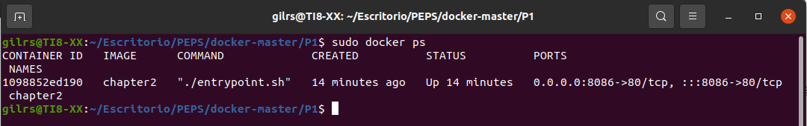
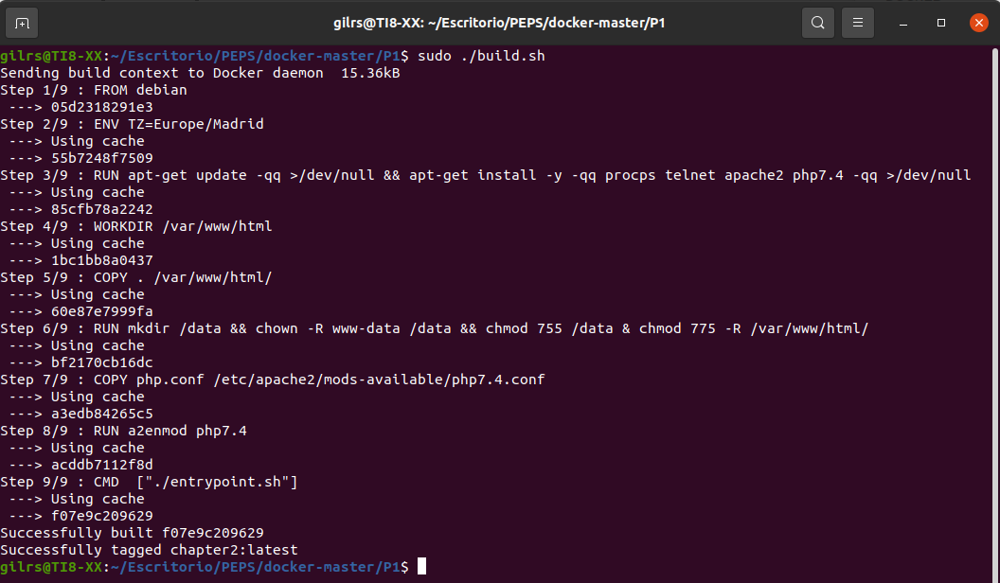
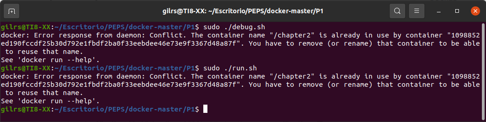
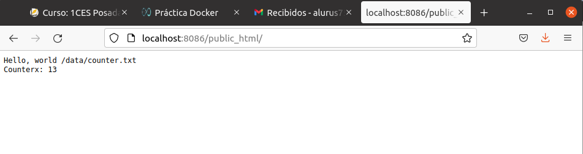
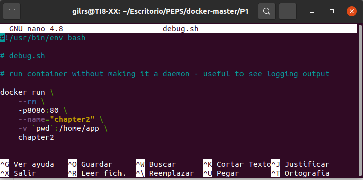

typora-copy-images-to: ../imagenes
typora-root-url: ../

## DOCKER

En está práctica se va a crear un primer contenedor y posteriormente ejecutarlo.

## Primer Contenedor

Para ello se va a utilizar un repositorio de GitHub que ya contiene los componentes contenedorizados: https://github.com/victorponz/docker/tree/master/P1.

Antes de empezar se procede a comprobar si Docker ya esta instalado en el equipo, para ello se ejecuta el comando docker ps:

Una vez ya se sabe como funciona el Dockerfile, se necesita ejecutar los siguientes archivos:

Una vez lanzado el debug.sh, se visita la página varias veces y se verá que el contenedor de visitas aumenta:

Cabe mensionar que en el archivo debug.sh se ha cambiado un ajuste  de puertos que es 8086:80 en lugar de 8086:80 

---

