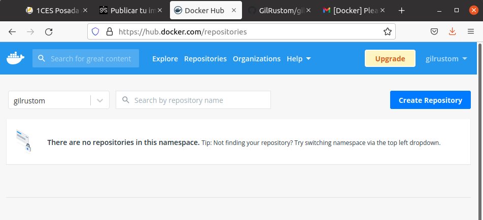
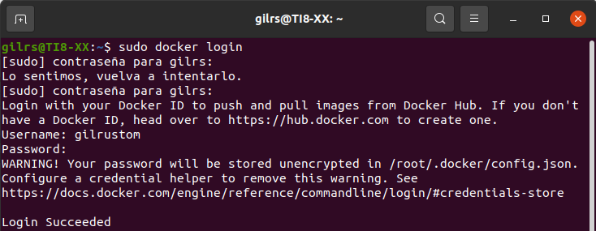
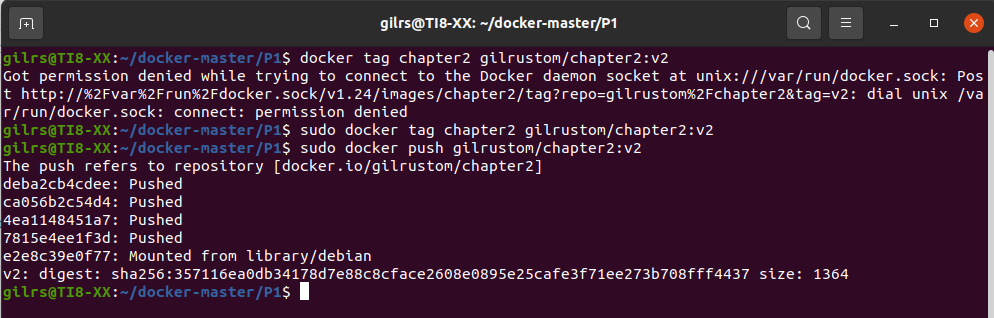
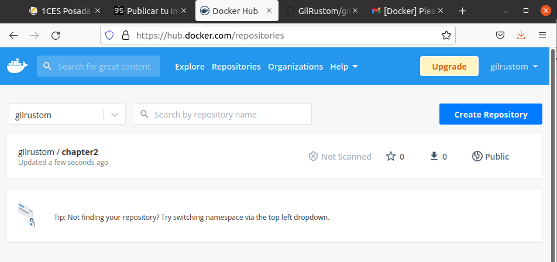

typora-copy-images-to: ../imagenes
typora-root-url: ../


## DOCKER HUB

El primer paso será crear una cuenta en docker hub:




A continuación, se logea con el usuario creado desde la consola:




Ahora desde la consola se accede al directoria donde está alojada la imagen del Docker creado y se ejecuta el comando docker tag chapter2 gilrustom/chapter2:v1 para crear el directorio y push para subirlo:




En la Web se puede ver que ya esta creado el repositorio y la imagen subida:




A continuación, se procede a buscar la imagen creada en la nube, por lo que inicialmente no la encontrará en local y entonces decidirá ir a buscarla a Docker Hub, que es el registro por defecto, para ello antes se procede a ejecutar el siguiente comando:

```shell
docker run -p 4000:3000 0gis0/nodejs-webapp:v1
```


---

