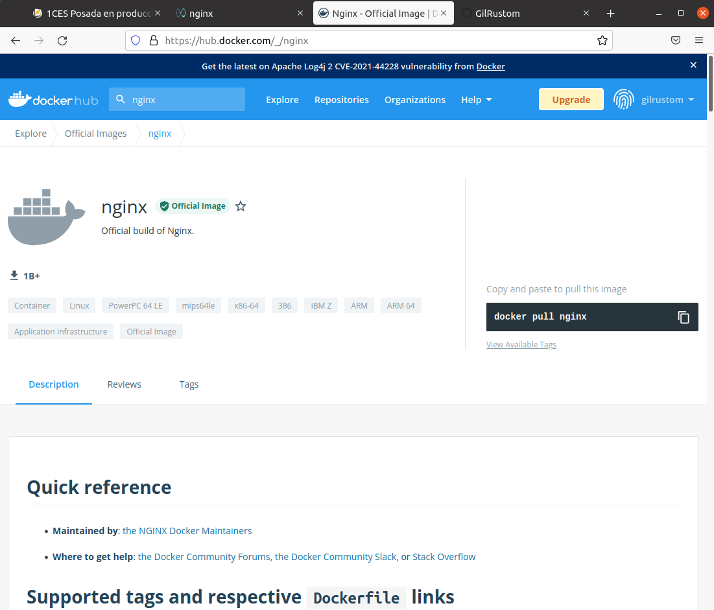
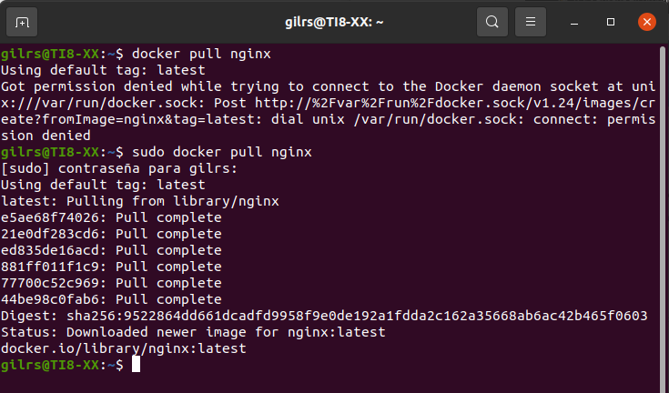
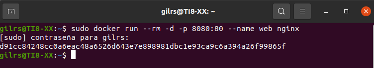
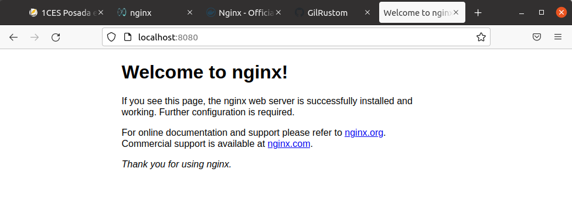
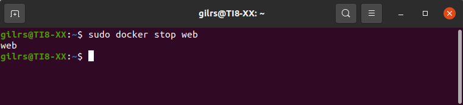
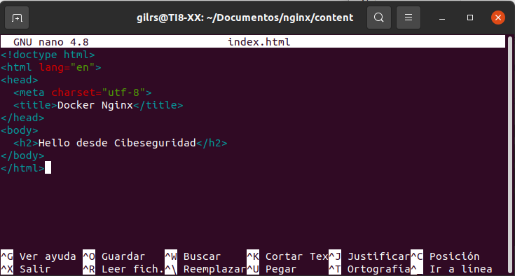
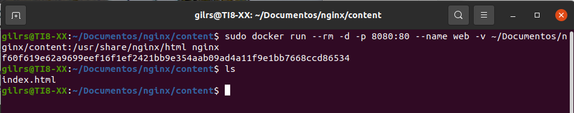
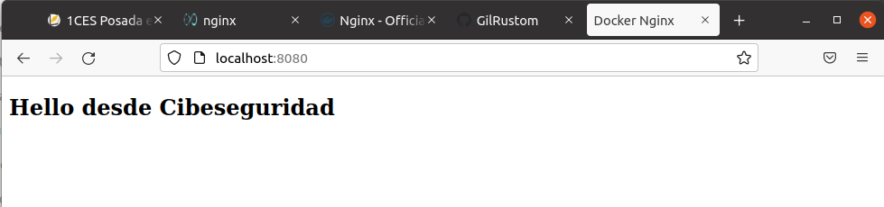

typora-copy-images-to: ../imagenes
typora-root-url: ../


# Nginx


## Introducción

Es un servidor web/proxy inverso ligero de alto rendimiento y un proxy para protocolos de correo electrónico.

Es software libre y de código abierto, licenciado bajo la licencia BSD simplificada, también existe una versión comercial distribuida bajo el nombre de Nginx Plus. Es multiplataforma, por lo que corre en sistemas tipo Unix y Windows.

## Instalación

Para realizar la instalación se procede a buscar la imagen de Nginx en DockerHub:




Se copia la imagen y se ejecuta en el terminal:




Con el siguiente comando se comienza a ejecutar el contenedor:

```
docker run --rm -d -p 8080:80 --name web nginx
```




Ahora se lanza el localhost:8080 en el navegador:



Lo que vemos es la página por defecto de `Nginx`. Pero ahora vamos a servir una hecha por nosotros:

Primero paramos el contenedor, llamado `web` ejecutando el siguiente comando:

```
docker stop web
```




## Agregar HTML personalizado

Para ello se crea un directorio en Documentos llamado nginx y dentro de le otro directorio llamado content en el que se agrega un archivo index.html con el siguiente contenido:

```
<!doctype html>
<html lang="en"> 
<head>  
  <meta charset="utf-8">  
  <title>Docker Nginx</title> 
</head> 
<body>  
  <h2>Hello desde Cibeseguridad</h2> 
</body> 
</html>
```




Ahora se procede a ejecutar el siguiente comando:

```
docker run --rm -d -p 8080:80 --name web -v ~/Documentos/nginx/site-content:/usr/share/nginx/html nginx
```

En la siguiente imagen se puede ver el resultado de la ejecución del comando anterior:



Ahora se ejecuta el localhost:8080 en el navegador:


