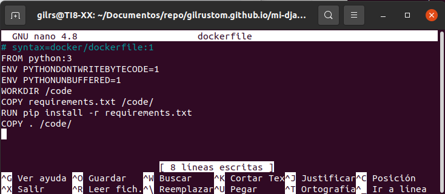
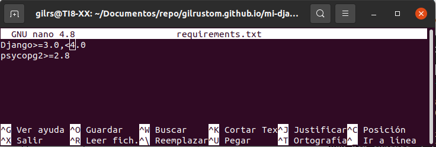
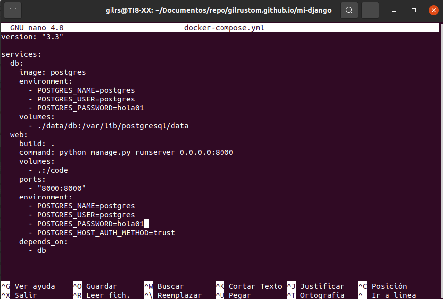
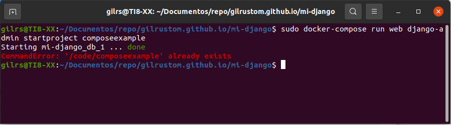
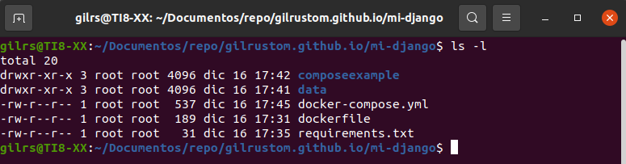
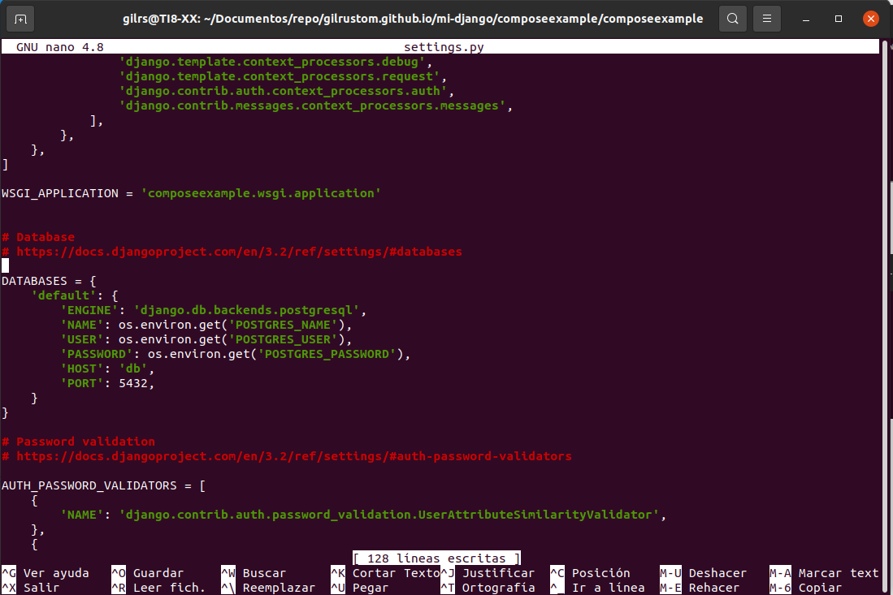
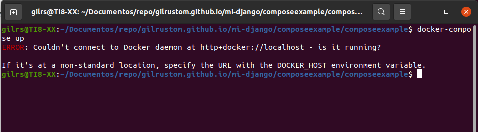

typora-copy-images-to: ../imagenes
typora-root-url: ../

## Django

## Instalación

A continuación, se procede a instalar el Django en su propio contenedor. 

Para ello se sigue los siguientes pasos:

1.- Crea un directorio vacío con el nombre mi-django donde se alojará la imagen docker-compose.yml. El directorio se crea en documentos:

2.- Cambiar al directorio donde se alojará la imagen.

3.- Crear un archivo nuevo con el nombre  Dockerfile en el directorio creado con el contenido:

4.- Crear el archivo requirements.txt con el contenido:

5.- Se crea un archivo llamado docker-compose.yml que inicia el django con el siguiente contenido:

4.- Ahora se procede a ejecutar el archivo anterior con el comando  sudo docker-compose run web django-admin startproject composeexample :

5.- Se verifica el contenido del directorio:

6.- Editar el fichero composeexample/settings.py y modificarlo:

7.- Ejecutar el comando docker-compose up:

Al final me da un error:

---

---

