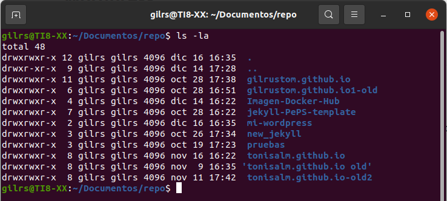
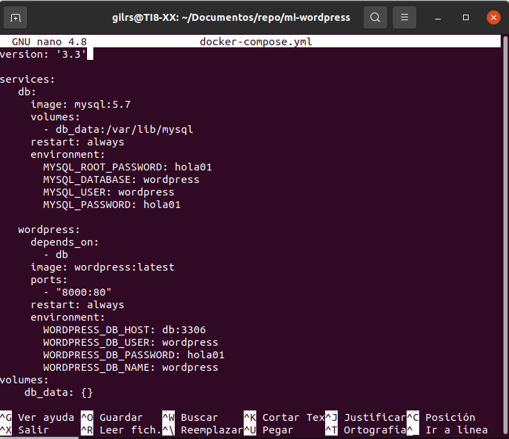
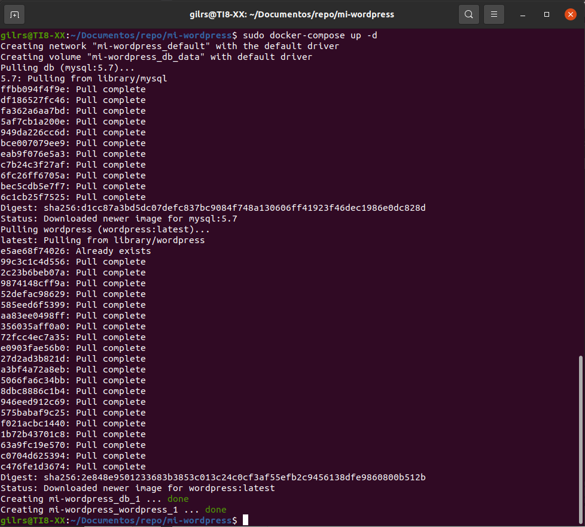
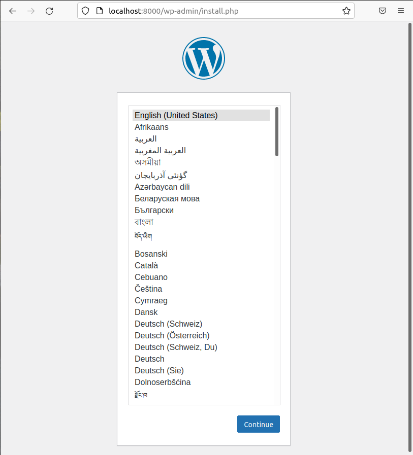

typora-copy-images-to: ../imagenes
typora-root-url: ../

## Wordpress

## Instalación

A continuación, se procede a instalar el Wordpress en su propio contenedor. 

Para ello se sigue los siguientes pasos:

1.- Crea un directorio vacío con el nombre mi-wordpress donde se alojará la imagen docker-compose.yml. El directorio se crea en documentos:

2.- Cambiar al directorio donde se alojará la imagen.

3.- Se crea un archivo llamado docker-compose.yml que inicia el blog de WordPress y una instancia de MySQL con el siguiente contenido:

4.- Ahora se procede a ejecutar el archivo anterior con el comando docker-compose up -d, el comando anterior se ejecuta en modo separado, extrae las imágenes de Docker necesarias e inicia los contenedores de wordpress y base de datos:

Cabe mensionar que antes de ejecutar el comando anterior hay que ejecutar los siguientes comandos:

- sudo apt-get update
- sudo apt  install docker-compose

Ahora si se procede a ejecutar el comando docker-compose up -d:

5.- Ahora WordPress debería estar ejecutándose en el puerto 8000 del Docker host localhost:8000

---

---

