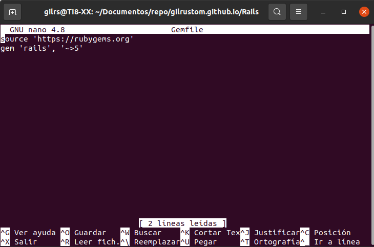
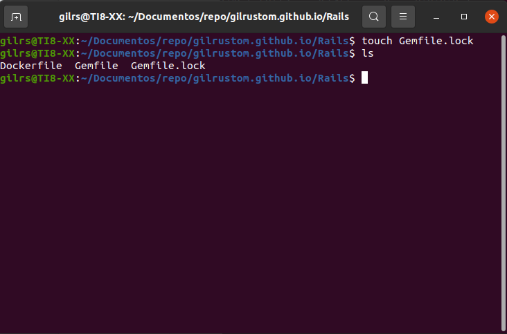
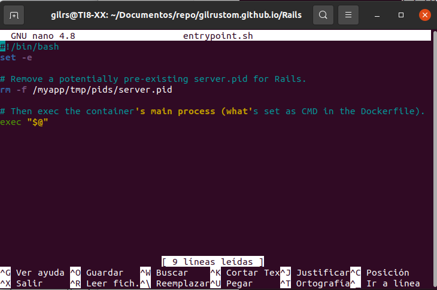
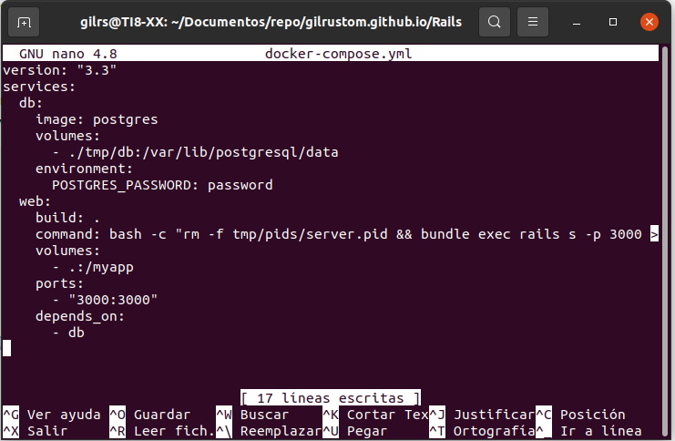
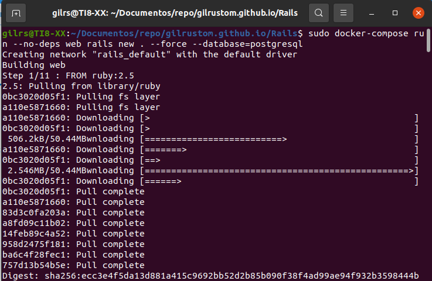
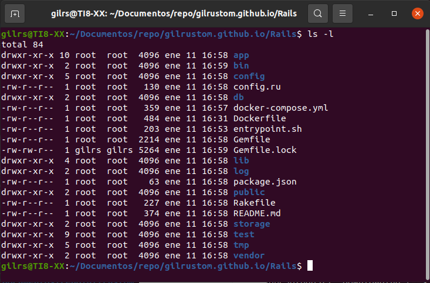
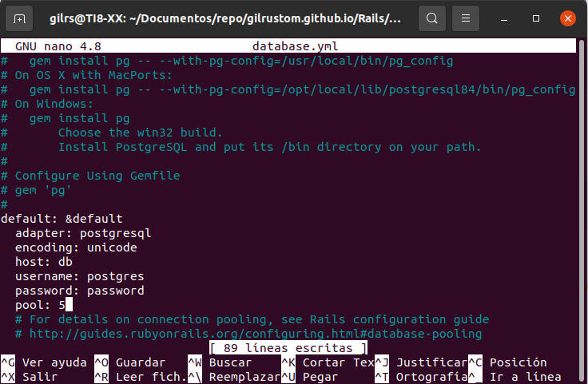
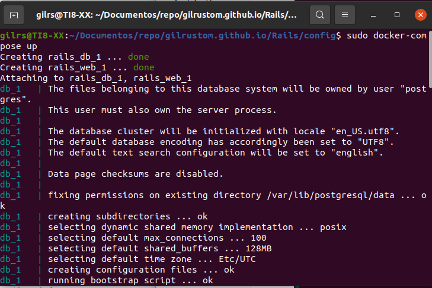
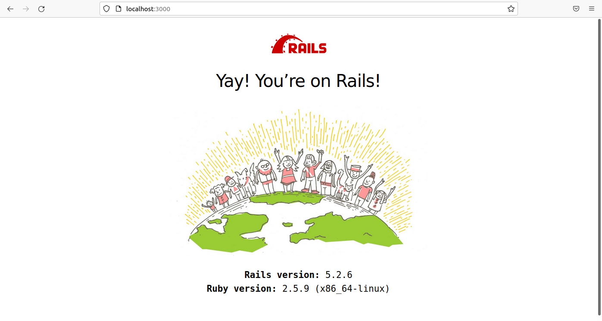

## Rails

## Instalación

- Crear un archivo nuevo con el nombre  Dockerfile en el directorio creado con el contenido:

  

- Crear el archivo Gemfile con el contenido:

  

- Se crea un archivo vacio Gemfile.lock para construir nuestro Dockerfile:

  

- Se crea el archivo entrypoint.sh para solucionar un problema específico de Rails que impide que el servidor se reinicie cuando un determinado archivo server.pid ya existe. Este script se ejecutará cada vez que se inicie el contenedor:

  

- Al final se crea un archivo llamado docker-compose.yml que inicia el Rails con el siguiente contenido:

  

- Ahora se procede a ejecutar el archivo anterior con el comando  sudo  docker-compose run --no-deps web rails new . --force --database=postgresql :

- Se verifica el contenido del directorio:

  

- En el archivo database.yml introducir los siguientes cambios:

  

- Se bootea la app con el comando: docker-compose up:

  

- Al final:

---------------------------------------------------------------------------------------------------------------------------------------------------------

