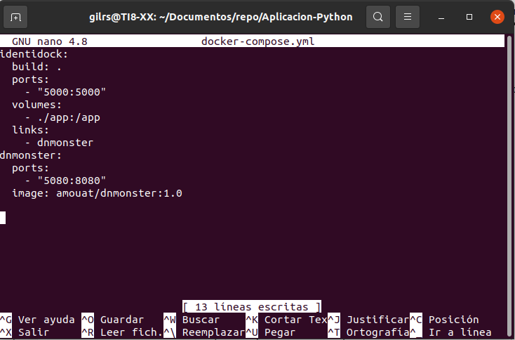

# Aplicación en Python

Antes de empezar primero se procede a crear un nuevo repositorio: https://github.com/GilRustom/Aplicacion-Python.git

A continuación, dentro del nuevo repositorio se crea la siguiente estructura:

Se crea la primera versión de una pequeña aplicación que, de momento, va a mostrar el mensaje Hello World!, para ello se introduce en el archivo Dockerfile el siguiente contenido:

A continuación se introduce el siguiente contenido en el archivo identidock.py:

Ahora se genera la imagen y a arrancar el contenedor, para ello se ejecutan los siguientes comandos:

 docker build -t identidock . 

docker run -d -p 5000:5000 identidock

Una vez iniciado el contenedor, se usará el comando curl para realizar una petición que devolverá el mensaje Hello World!:

Ahora se procede a parar el contenedor creado:

A continuación, se modifica el contenido del archivo identidock.py:

Cada vez que se hace una modificación en el código se debe parar y reiniciar el contenedor. Se puede mejorar haciendo un *bind mount* del directorio local app de tal forma que quedaría de esta forma. Ahora si se vuelve a ejecutar el comando curl localhost:5000 devuelve el siguiente mensaje:

## Identicons

A continuación, se procede a convertir la aplicación creada anteriormente en una aplicación web que, dado un nombr de usuario, genere un identicon. Para ello se modifica el contenido del fichero identidock.py:

Si se ejecuta el 127.0.0.1:5000 el resultado será:

## Generador de imágenes

A continuación, se inicia un contenedor con una imagen de dnmonster que proporciona avatares únicos para una cadena dada. Para ello se usuará una imagen de este servicio más adelante que expone una API REST para generar las imágenes.

Se procede a modificar el archivo identidock.py con el siguiente contenido:

Se debe incluir el paquete requests en la instalación, por lo que se procede a modificar el contenido del fichero Dockerfile:

Ahora ya se puede iniciar la imagen para lanzar el contenedor de dmonster y enlazarlo con la aplicación creada anteriormente. Para ello se ejecuta el comando docker run -d --name dnmonster amouat/dnmonster:1.0 

Se inicia el contenedor de la aplicación casi de la misma manera que la anterior pero con un cambio en el comando: docker run -d -p 5000:5000 --link dnmonster:dnmonster identidock:

Si se abre http://localhost:5000 se debe ver la página como lo siguiente:

## Generar identicons

Para ello se procede a crear el archivo docker-compose.yml:

Ahora se debe parar el contenedor y luego ejecutar el comando docker-compose up -d:

Ahora sólo queda hacer que funcione el botón submit. Para ello se introduce una modificación en el contenido del archivo identidock.py:

Ahora cada vez que se introduce un nombre, se devuelve un mon

## Añadir cacheo

Existe un problema que cada vez que se solicita un monstruo, se hace una llamada computacionalmente costosa al servicio dnmonster, pero no hay necesidad de esto ya que el objetivo de un icono de identificación es  que la imagen sigue siendo la misma para una entrada determinada, por lo que se debe almacenar en caché el resultado, para ello:

- Agregar el servicio Redis al archivo docker-compose.yml:

  

- Instalar el redis dentro de la imagen en el archivo Dockerfile:

  

- Modificar el código para unar la imagen redis en el archivo identidock.py:

  

Al final solo queda parar el contenedor, construirlo y levantarlo, para ello se ejecutan los siguientes comandos:

- docker-compose stop
- docker-compose build
- docker-compose up -d

--------------------------------------------------------------------------------------------------------------------------------------------------------------------------------------------------------------------------------------------------------------------------------------------

