# Jenkins

Jenkins es un servidor de automatización de código abierto escrito en  Java. Con un soporte muy activo basado en la comunidad y una gran  cantidad de complementos.

## Instalación:

El primer paso hay que crear un directorio para más adelante enlazarlo como volumen al iniciar jenkins.

A continuación, se procede a cambiar el propietario del directorio creado y cambiar los permisos

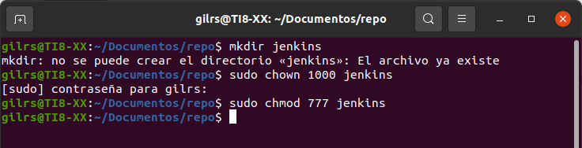

A continuación, se ejecuta el comando docker run:

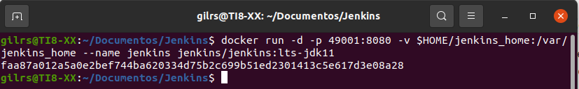

Ahora Visitamos la url http://localhost:49001/ y pedirá la contraseña de administrador:

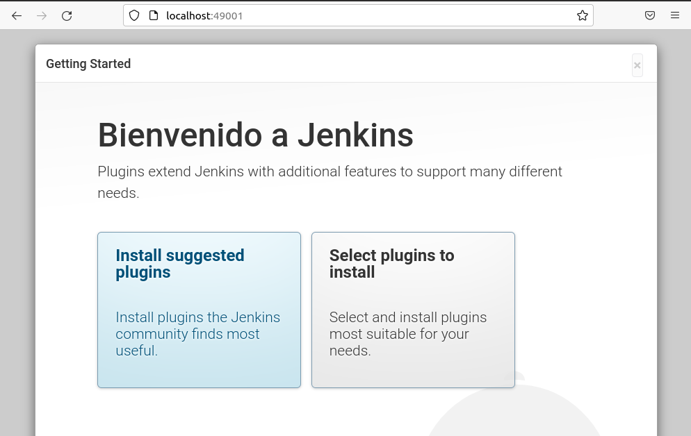

A continuación, se selecciona los plugins sugeridos por defecto:

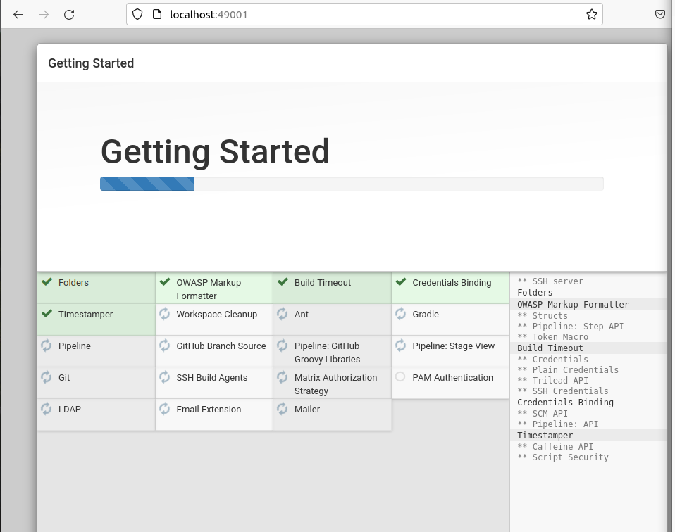

Ahora pide los datos del usuario administrador del sistema para aaceder a la ventana de administrador de jenkins:

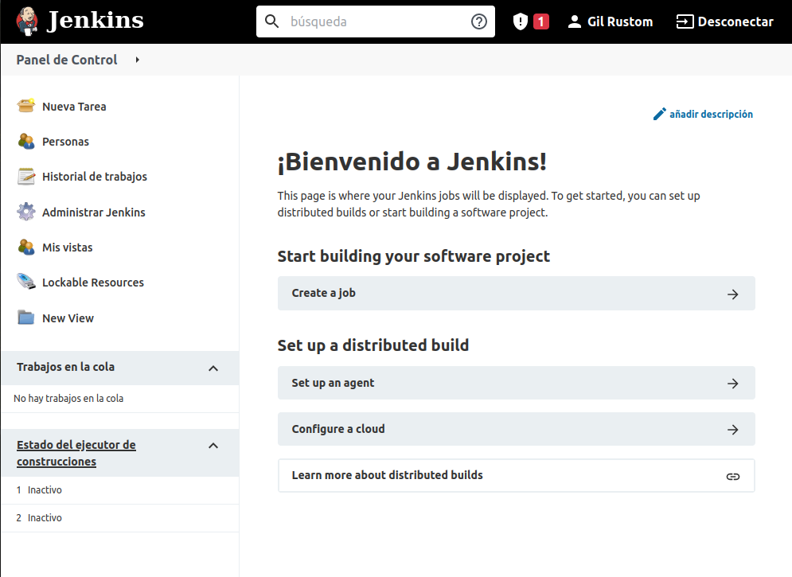

## Jenkins Ejemplo Calculator

- Se crea un repositorio en el Github y dentro se crea el archivo readme.md:

  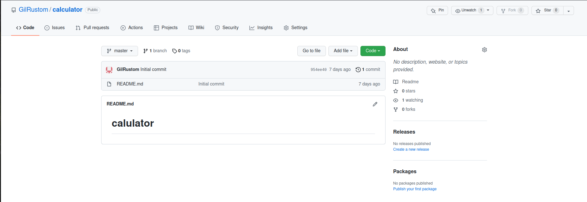

  

- En la pagina de jenkins se procede a ejecutar Build Now:

  

- Se accede a  http://start.spring.io/ y se sigue los pasos:

  1. Seleccionar el proyecto Gradle en lugar del proyecto Maven.
  2. Rellenar `Group` y `Artifact` (por ejemplo, `com.gilrs` y `calculator`).
  3. Agregar `Web` a Dependencias.
  4. Hacer clic en Generar proyecto.
  5. El esqueleto del programa generado debe descargarse (el archivo calculator.zip).

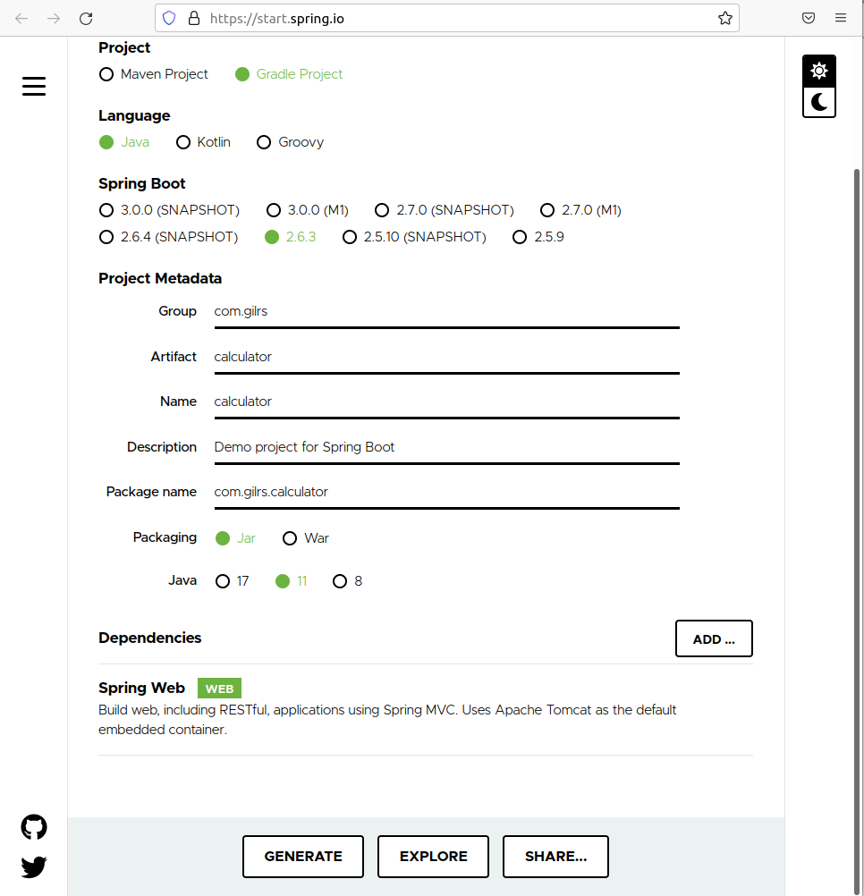

Ahora se hace clic en generar y crea un calculator.zip, se descomprime y se sube al github: https://github.com/GilRustom/calculator

- Ahora se cambia en el archivo build.gradle el id 'org.springframework.boot' version '2.6.3' por id 'org.springframework.boot' version '2.6.2' :

  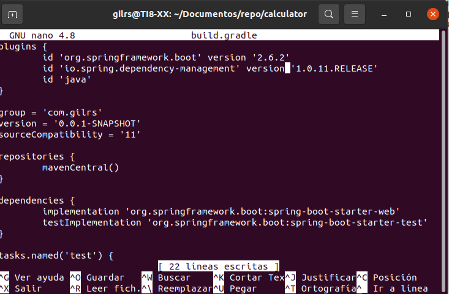

- Ahora se pode compilar el proyecto localmente con los comandos ./gradlew compileJava:

  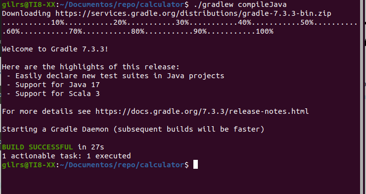

## Creación de la etapa de compilación

Se usa exactamente el mismo comando localmente y en la pipeline de Jenkins.

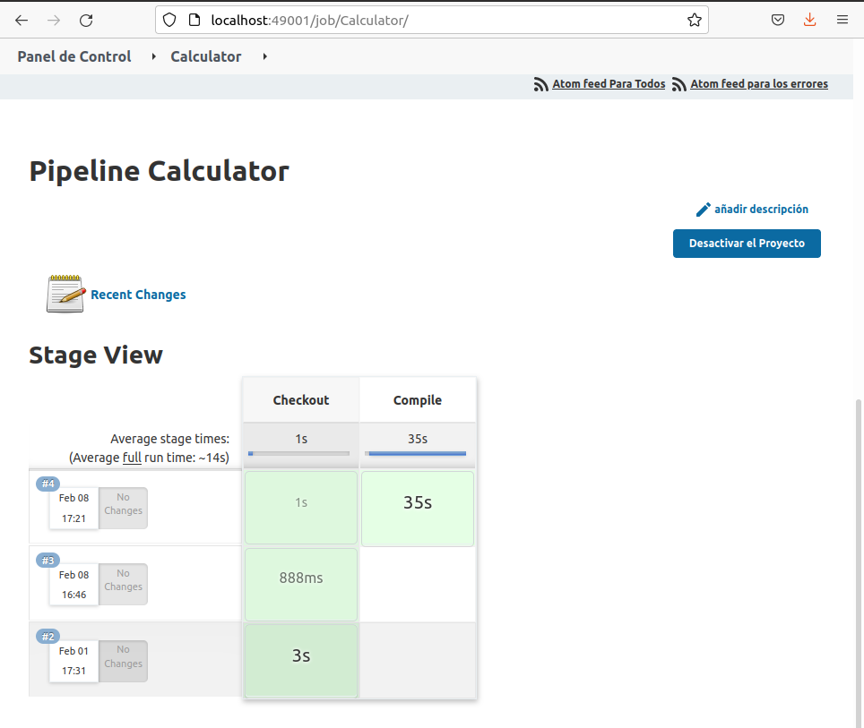

## Test unitario

La primera versión de la calculadora podrá sumar dos números, Para ello se agrega la la lógica empresarial como una clase en el archivo: src/main/java/com/victorponz/calculator/Calculator.java

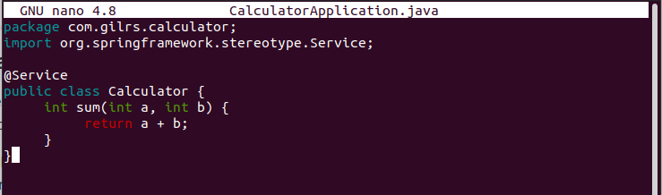

Para poder ejecutar la lógica empresarial, también se debe agregar el controlador de servicio web en un archivo separado `src/main/java/com/victorponz/calculator/CalculatorController.java`:

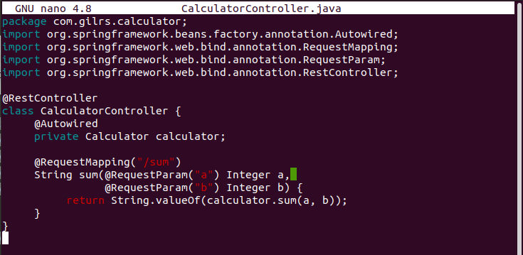

Se ejecuta la aplicación y ver cómo funciona ./gradlew bootRun y al final abrir la página http://localhost:8080/sum?a=1&b=2. Esto debería sumar dos números ( 1 y 2) y mostrar 3 en el navegador.

------------------------

------------------------

--------------------

