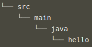
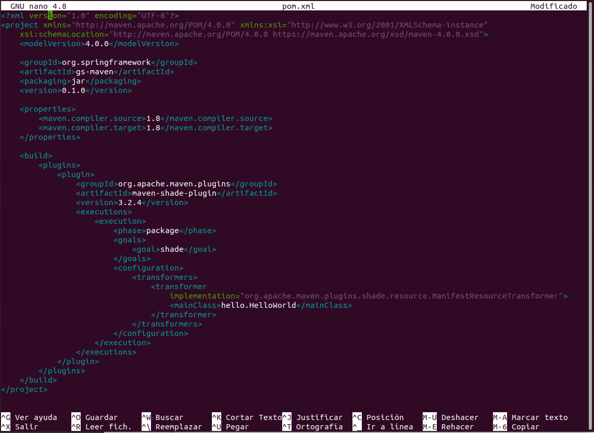

# Aplicación en Maven

## Configuración

Antes de empezar se procede a crear la siguiente estructura en el equipo local:

- Se crea dentro del directorio src/main/hello se crea el archivo HelloWorld.java con el siguiente contenido:

  

- Se crea el archivo Greeter.java dentro del directorio src/main/java/hello:

  

- A continuación, se procede a instalar maven y luego se ejecuta el comando export PATH=/opt/apache-maven-3.8.4/bin:$PATH y al final para probar la instalación se ejecuta el comando mvn -v:

  

  

## Definición de proyecto

Los proyectos hechos con maven se definen con un archico de tipo xml llamado pom.xml, para ello se procede a crear un archivo con el nombre pom.xml en la carpeta raiz del proyecto con el siguiente contenido:

## Construir código java

Maven está ahora listo para construir el proyecto.

Para probar la compilación se ejecuta el comando mvn compile:

- Se ejecuta el mvn package:

  

## Declarar dependencias

Si se quiere que además de decir “¡Hola Mundo!”,  se quiere que la aplicación imprima la fecha y hora actuales se debe cambiar el contenido del fichero HelloWorld.java:

A continuación, se añade dependencias al archivo pom.xml:

## Prueba

El primer paso es añadir JUnit como una dependencia a tu pom.xml, en el ámbito de la prueba, en la captura anterior se puede ver que se ha añadido.

Ahora se crea un caso de prueba en el directorio src/test/java/hello/GreeterTest.java como el siguiente:

Se añade tambien la independencia hamcrest al archivo pom.xml y se ejecuta el comando mvn test:

--------------------

------------------

--------------

